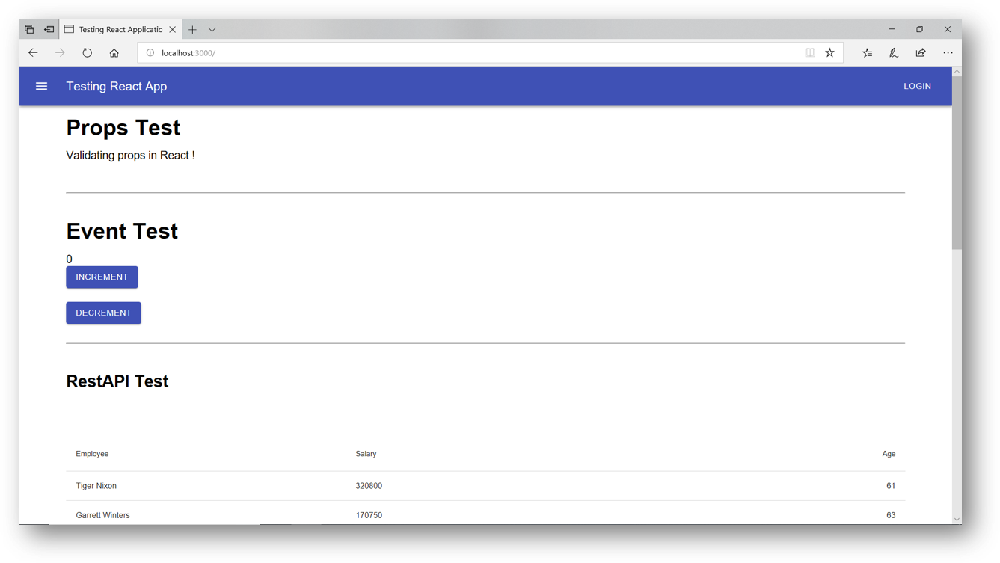

# Testing React using Jest and Enzyme



## Installation

```bash
# Package Installation
npm install

# Run the Project
npm start

# Project Test
npm test

# Generate Code Coverage Report
npm run test -- --coverage --watchAll=false
```

## Project Covers

- Props Test
- Event Test
- Rest API Test
- Component Test
- Mock functions
- DOM Test
- Snapshot Test

## Technology

- [React](https://create-react-app.dev/docs/getting-started/)
- [Jest](https://jestjs.io/docs/en/getting-started.html)
- [Enzyme](https://enzymejs.github.io/enzyme/docs/installation/react-16.html)
- [Material-UI](https://material-ui.com/getting-started/installation/)
- [Axios](https://github.com/axios/axios)
- [React Testing Library](https://reactjs.org/docs/testing-recipes.html)
